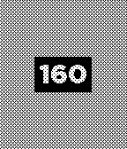
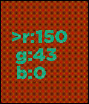
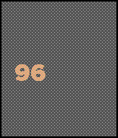
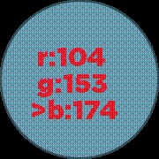
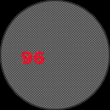

# dither-library
24bit color -> 6bit color dithering library for Pebble.  

Draws a filled rectangle to the screen which is dithered from 24bit (3 channels of 8bit colors: red, green and blue) color down to Pebble's native 6bit color.  

Also can replace screen colors with the dithered color, allowing you to use native pebble API calls (e.g. `graphics_draw_line`, `graphics_fill_circle`, `gpath_draw_filled`, etc.) with dithered colors.  To do this, draw with the Pebble function using a placeholder color that doesn't occur anywhere else on the screen, then call `replace_color_with_dithered` (see: below) to replace that placeholder color with the dithered color.  Or use `replace_color_in_rect_with_dithered` to only replace colors within a screen region.

Currently it does not work on antialiased shapes, unless you specifically replace each color.  For instance, if you draw an antialiased red (GColorRed=0b11110000) line on a black background, you'd have to run the replacement funciton 3 times: once for red, once for darker red (GColorDarkCandyAppleRed=0b111000) and once for darkest red (GColorBulgarianRose=0b11010000).  Each will be replaced with the full dithered color, so the input 24bit RGB must be darkened to reproduce the antialiased look.

##Screenshots  
Aplite:  
  

Basalt:  
   

Chalk:  
   

##Function calls  
#####`fill_rect_dithered(ctx, rect, r, g, b)`  
Given a graphics context, a rect (absolute screen coordinates), and a 24bit RGB color, draws a rectangle filled with a dithered (patterned) 6-bit color.  Note that rect uses absolute screen coordinates, unlike `graphics_fill_rect()` which draws relative to its layer.

#####`replace_color_with_dithered(ctx, replacement_color, r, g, b)`  
Given a graphcs context, a color to look for, and a 24bit RGB dithered color to replace it with, searches the ENTIRE SCREEN for `replacement_color` and replaces it with a 6bit color dithered from the 24bit RGB given.  Note that it currently doesn't ignore the `alpha` channel, though screen pixels are nearly always `alpha = 3`.

#####`replace_color_in_rect_with_dithered(ctx, rect, replacement_color, r, g, b)`  
Same as `replace_color_with_dithered()` but only searches within the `rect` for `replacement_color`.  Note that `rect` uses absolute screen coordinates, unlike normal Pebble API functions (e.g. `graphics_fill_rect()`) which draw relative to their layer.

